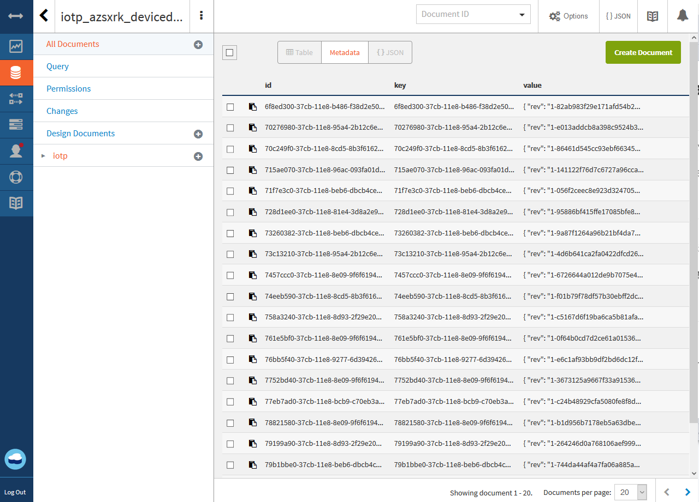
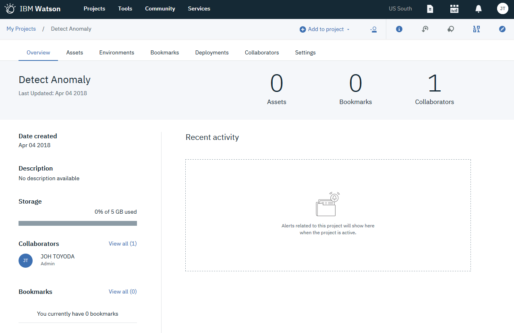
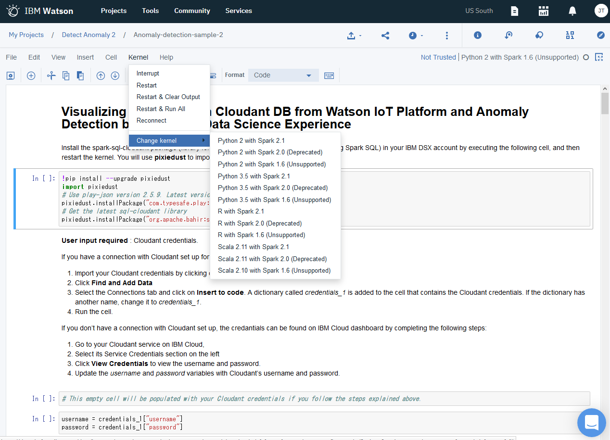
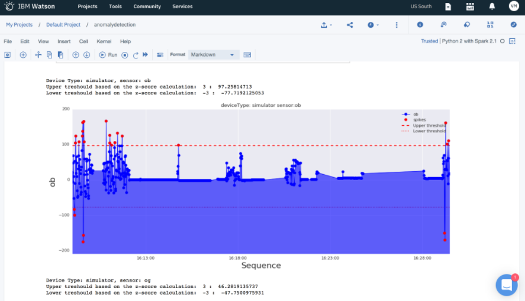

# Gather, visualize, and analyze IoT data
　このチュートリアルでは、IoT deviceをセットアップし、Watson IoT platformに収集したのち、データの可視化とmachine learningサービスを利用してデータを分析して履歴データから異常を検出するまでの一連の流れを学習します。

## チュートリアルの内容
- IoT Simulatorのセットアップ
- 収集したデータをWatson IoTPlatformへ送信
- データの可視化
- デバイスが生成したデータを解析し、異常を検知する

## 利用製品／サービス
- [Internet Of Things platform](https://console.bluemix.net/catalog/services/internet-of-things-platform
)
- [Node.js Application](https://console.bluemix.net/catalog/starters/sdk-for-nodejs
)
- [Data Science Experience](https://console.bluemix.net/catalog/services/data-science-experience
)(with Spark service and IBM Cloud Object Storage)
- [Cloudant NoSQL Database](https://console.bluemix.net/catalog/services/cloudant-nosql-db
)

## アーキテクチャ


- デバイスからデータをMQTTでIoT Platformに送信
- IoT Platformのヒストリアン・データをCloudant NoSQL DBに保管
- Data Science Experienceを利用して保管されたデータを分析
- コンソールで結果を表示

## IoT Platform の作成
　始めに、Internet of Things Platformサービス（IoT Platform サービス）を作成します。IoT Platform サービスは、管理されたデバイスからのデータを安全に収集し、可視化や他のアプリケーションから利用できるように履歴データを保存することのできるサービスです。

1. [**IBM Cloud Catalog**](https://console.bluemix.net/catalog/) に移動し、**IoT** セクションの [**Internet of Things Platform**](https://console.bluemix.net/catalog/services/internet-of-things-platform) を選択します。
2. サービス名に、***IoT demo hub*** と入力し、**作成** をクリック後 **起動** をクリックし、**IBM Watson IoT Platform dashboard** を表示させます。
3. サイドメニューから **セキュリティ** を選択し、**接続セキュリティー** にある編集アイコン（鉛筆マーク）をクリックします。
4. **デフォルト規則** セクションで範囲が **デフォルト** のセキュリティー・レベルを **TLS（オプション）** に設定して **保存** をクリックします。
5. サイドメニューから **デバイス** を選択し、**デバイス・タイプ** タブをクリック後、**＋デバイス・タイプの追加** をクリックします。
6. **Name** に ***simulator*** と入力し、タイプは **デバイス** のまま、**次へ** をクリック後 **完了** をクリックします。
7. 表示された画面で **デバイスの登録** をクリックします。**既存のデバイス・タイプの選択** で **simulator** を選択し、**デバイスID** に ***phone*** を設定して **次へ** をクリックします。
8. 表示された画面で **セキュリティ** タブをクリックし、**認証トークン** に ***My_Auth_Token_01*** を設定し **次へ** をクリックします。
9. 要約画面で内容を確認し、**完了** をクリックします。表示された画面はそのまま開いたままにしておいてください。

ここまでの作業でIoT Platformはデータを受信する準備が整いました。

## デバイスシミュレータの作成
　続いてIoT Platformにデータを送信するためのデバイス用アプリケーションを作成します。アプリケーションはNode.jsで記述されており、Githubに用意されているサンプルをIBM Cloudにデプロイすることで利用可能となります。

1. GitHubのリポジトリから、以下のコマンドでサンプルのアプリケーションをCloneします。
```bash
git clone https://github.com/IBM-Cloud/iot-device-phone-simulator
```
``Cloneの際、GitHubへのユーザー登録が必要となります。登録がない場合は登録してCloneを実施してください。
``
2. Cloneされたアプリケーションのプロジェクトルートディレクトリへと移動します。
```bash
cd iot-device-Simulator
```
3. manifest.ymlファイルを開き、host属性およびname属性を任意のものに変更します。
4. IBM CloudへCloneされたアプリケーションをPushします。
```bash
bx login
bx target --cf
bx cf push
```
5. ***<manifest.ymlで指定したホスト名>.mybluemix.net*** というURLでアプリケーションがデプロイされます。デプロイ完了までしばらく待ったのち、モバイルデバイスのブラウザーからこのURLにhttpプロトコルでアクセスします。
6. **Organization ID** に組織のID（IoT Platform Dashboardの右上に表示されていrます）、**Device Type** に ***simulator***、**Device ID** に ***phone***、**Authentication Token** に先ほど設定した **認証トークン**(この資料では ***My_Auth_Token_01***)と入力し、**Connect** ボタンをクリックします。
7. ブラウザ上でメッセージのプッシュが確認できます。IBM Watson Iot Platform Tabに戻り、**最近のイベント** リンクをクリックすると、受信されたデータが表示されます。


## ライブデータの表示
 続いて、ダッシュボード上にデバイスデータを表示するためのカードを作ります。ダッシュボートとカードについての詳細は、[ボードとカードを利用したリアルタイム・データの視覚化](https://console.bluemix.net/docs/services/IoT/data_visualization.html#boards_and_cards)を参照してください。

### ボードの作成
1. **IBM Watson IoT Platform dashboad** を開きます。
2. 左側メニューから **ボード** を選択し、**+新規ボードの作成** をクリックします。
3. 任意の名前（例：simulators）をつけて、**次へ** をクリックし **送信** をクリックします。
4. 作成したボードをクリックして開きます。

### デバイスデータを表示するカードの作成
1. **+新しいカードの追加**をクリックします。**
2. カード・タイプとしてデバイスセクションにある **線グラフ** を選択します。
3. デバイスとして作成したデバイスを選択し、**次へ** をクリックします。
4. **新規データセットの接続** をクリックします。以下の値をセットして **次へ** をクリックします。
  - イベント: ***sensorData***
  - プロパティ: ***ob***
  - 名前: ***OrientationBeta***
  - タイプ: ***浮動小数点***
  - 最小: ***-180***
  - 最大: ***180***
5. カード・プレビューページで、設定で **L** を選択し、**次へ** をクリックし、**送信** をクリックします。作成したグラフが表示されます。
6. モバイルデバイスのブラウザーから再度設定したURLに接続します。接続後、デバイスをゆっくりと動かしてみてください。グラフにデバイスの動きが記録されています。

## ヒストリカルデータをCloudant DBに保存する
1. [**IBM Cloud Catalog**](https://console.bluemix.net/catalog/)から [**Cloudant NoSQL Database**](https://console.bluemix.net/catalog/services/cloudant-nosql-db?taxonomyNavigation=app-services)を選択し、名前に ***iot-db*** と設定して作成します。
2. **IBM Watson IoT Platform dashboad** を開きます。
3. 左側メニューから **拡張** を選択し、履歴データ・ストレージの **セットアップ** をクリックします。
4. ***iot-db*** を選択します。
5. データベース名に ***devicedata*** と設定して完了をクリックします。
6. 認可を求める画面が開くので、アクセスを許可します。もし認可を求める画面が開かない場合、Pop up ブロッカーをoffにして再度試してみてください。

この設定で、デバイスのデータがCloudant NoSQL DBに保存されるようになりました。Cloudantのダッシュボードを開きデータが保管されていることを確認してください。


## 機械学習を用いた異常の検知
　ここでは、IBM Watson Studio サービスで利用可能なJupyter Notebookを利用して、Cloudantに保管された履歴データをロードし、z-scoreを利用して異常を検知する方法を学びます。(z-scoreは平均値からどれだけ離れているかを示す値です)

### 新規プロジェクトの作成
1. [**IBM Cloud Catalog**](https://console.bluemix.net/catalog/)にアクセスし、Watsonセクションにある[**Watson Studio**](https://console.bluemix.net/catalog/services/data-science-experience)を選択します。
2. サービスを任意の名前で作成し、**Get Started** をクリックします。
3. **New Project** をクリックし、**Jupyter Notebooks** を選択し **OK** をクリックします。
4. プロジェクトの名前に ***Detect Anomaly*** を設定します。
5. **Restrict who can be a collaborator** はチェックを外したままにします。
6. Define Strageセクションで 既存のobject strage サービスを選択するか、新規に作成して追加します。
7. **Create** をクリックします。次のような画面が表示され準備が整いました。


### CloudantDBとの接続
1. **Assets** タブを表示し、**+Add to project** をクリックし、**connection** を選択します。
2. デバイスデータが保存されている ***iot-db*** を選択し **Create** をクリックします。

### jupyter(ipynb) notebookの作成
1. [**IBM Cloud Catalog**](https://console.bluemix.net/catalog/)にアクセスし、データ&分析セクションにある[**Apache Spark**](https://console.bluemix.net/catalog/services/apache-spark?bss_account=3d40d897302501f3391c73e3029701f3&taxonomyNavigation=data)を選択します。
2. 任意の名前をつけて **作成** ボタンをクリックします。
3. [**Watson Studio**](http://dataplatform.ibm.com)画面に戻り、作成したプロジェクトの **Assets** にて、**New Notebook** を選択し、**From URL** タブをクリックします。
4. Nameに**Anomaly-detection-sample**、URLに**https://raw.githubusercontent.com/IBM-Cloud/iot-device-phone-simulator/master/anomaly-detection/Anomaly-detection-DSX.ipynb**、runtimeに作成した**Apache Spark** を選択し、**Create Notebook** をクリックします。
5. 表示された画面で、**kernel** を```Python 2 with Spark 2.1```に変更し、画面上の **Not Trusted** リンクをクリックして **Trust** 状態に変更します。


### notebookの実行と異常の検知
1. ``!pip install --upgrade pixiedust``で始まるCellを選択し、**Run** をクリックします。
2. モジュールのインストールが完了したら **Restart Kernel** アイコンをクリックします。
3. 次のCellにCloudantのCredential情報をインポートします。画面右上のアイコンをクリックし、**Connections** タブを選択します。**Insert to code** リンクをクリックし、Credential情報を設定するCellを追加します。Cell中の変数名が　***Credentail_1*** と異なる場合、名前を変更して ***Credential_1*** にします。
4. 次のCellにあるデータベース名(dbName)を変更します。値は、デバイスの情報が保持されているCloudantデータベース名です。（例：*iotp_組織ID_DBName_Year-Month-Day* )
5. Notebookほ保存し、その後　**Cell** > **Run ALL** を選択して実行します。結果としてグラフが表示されます。


---

これでこのチュートリアルは終了です。
