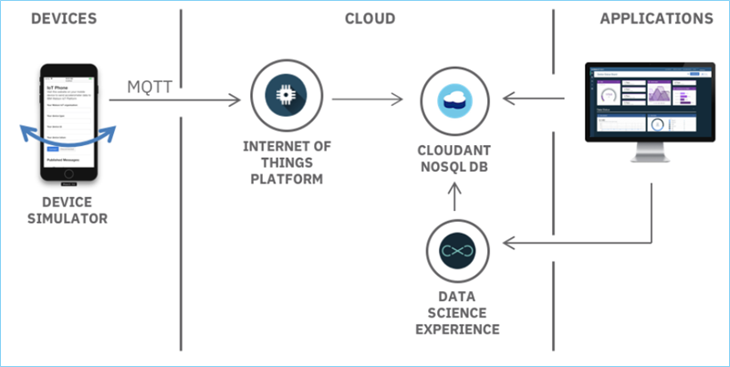
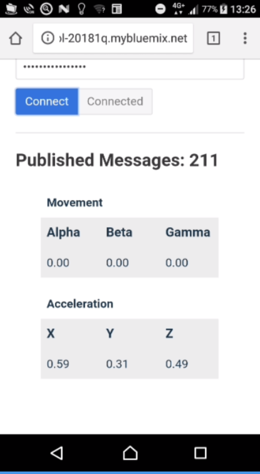
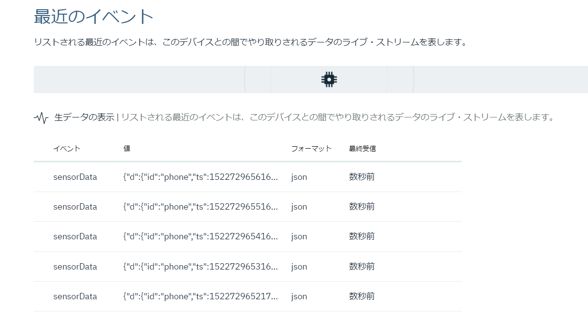

# Gather, visualize, and analyze IoT data
　このチュートリアルでは、IoT deviceをセットアップし、Watson IoT platformに収集したのち、データの可視化とmachine learningサービスを利用してデータを分析して履歴データから異常を検出するまでの一連の流れを学習します。

## チュートリアルの内容
- Iot Simulatorのセットアップ
- 収集したデータをWatson IoTPlatformへ送信
- データの可視化
- デバイスが生成したデータを解析し、異常を検知する

## 利用製品／サービス
- [Internet Of Things platform](https://console.bluemix.net/catalog/services/internet-of-things-platform
)
- [Node.js Application](https://console.bluemix.net/catalog/starters/sdk-for-nodejs
)
- [Data Science Experience](https://console.bluemix.net/catalog/services/data-science-experience
)(with Spark service and IBM Cloud Object Storage)
- [Cloudant NoSQL Database](https://console.bluemix.net/catalog/services/cloudant-nosql-db
)

## アーキテクチャ


- デバイスからデータをMQTTでIoT Platformに送信
- IoT Platformのヒストリアン・データをCloudant NoSQL DBに保管
- Data Science Experienceを利用して保管されたデータを分析
- コンソールで結果を表示

## IoT Platform の作成
　始めに、Internet of Things Platformサービス（IoT Platform サービス）を作成します。IoT Platform サービスは、管理されたデバイスからのデータを安全に収集し、可視化や他のアプリケーションから利用できるように履歴データを保存することのできるサービスです。

1. [**IBM Cloud Catalog**](https://console.bluemix.net/catalog/) に移動し、**IoT** セクションの [**Internet of Things Platform**](https://console.bluemix.net/catalog/services/internet-of-things-platform) を選択します。
2. サービス名に、***IoT demo hub*** と入力し、**作成** をクリック後 **起動** をクリックし、**IBM Watson IoT Platform dashboard** を表示させます。
3. サイドメニューから **セキュリティ** を選択し、**接続セキュリティー** にある編集アイコン（鉛筆マーク）をクリックします。
4. **デフォルト規則** セクションで範囲が **デフォルト** のセキュリティー・レベルを **TLS（オプション）** に設定して **保存** をクリックします。
5. サイドメニューから **デバイス** を選択し、**デバイス・タイプ** タブをクリック後、**＋デバイス・タイプの追加** をクリックします。
6. **Name** に ***simulator*** と入力し、タイプは **デバイス** のまま、**次へ** をクリック後 **完了** をクリックします。
7. 表示された画面で **デバイスの登録** をクリックします。**既存のデバイス・タイプの選択** で **simulator** を選択し、**デバイスID** に ***phone*** を設定して **次へ** をクリックします。
8. 表示された画面で **セキュリティ** タブをクリックし、**認証トークン** に ***My_Auth_Token_01*** を設定し **次へ** をクリックします。
9. 要約画面で内容を確認し、**完了** をクリックします。表示された画面はそのまま開いたままにしておいてください。

ここまでの作業でIoT Platformはデータを受信する準備が整いました。

## デバイスシミュレータの作成
　続いてIoT Platformにデータを送信するためのデバイス用アプリケーションを作成します。アプリケーションはNode.jsで記述されており、Githubに用意されているサンプルをIBM Cloudにデプロイすることで利用可能となります。

1. GitHubのリポジトリから、以下のコマンドでサンプルのアプリケーションをCloneします。
```bash
git clone https://github.com/IBM-Cloud/iot-device-phone-simulator
```
``Cloneの際、GitHubへのユーザー登録が必要となります。登録がない場合は登録してCloneを実施してください。
``
2. Cloneされたアプリケーションのプロジェクトルートディレクトリへと移動します。
```bash
cd iot-device-Simulator
```
3. manifest.ymlファイルを開き、host属性およびname属性を任意のものに変更します。
4. IBM CloudへCloneされたアプリケーションをPushします。
```bash
bx login
bx target --cf
bx cf push
```
5. ***<manifest.ymlで指定したホスト名>.mybluemix.net*** というURLでアプリケーションがデプロイされます。デプロイ完了までしばらく待ったのち、モバイルデバイスのブラウザーからこのURLにhttpプロトコルでアクセスします。
6. **Organization ID** に組織のID（IoT Platform Dashboardの右上に表示されていrます）、**Device Type** に ***simulator***、**Device ID** に ***phone***、**Authentication Token** に先ほど設定した **認証トークン**(この資料では ***My_Auth_Token_01***)と入力し、**Connect** ボタンをクリックします。
7. ブラウザ上でメッセージのプッシュが確認できます。IBM Watson Iot Platform Tabに戻り、**最近のイベント** リンクをクリックすると、受信されたデータが表示されます。


## ライブデータの表示
