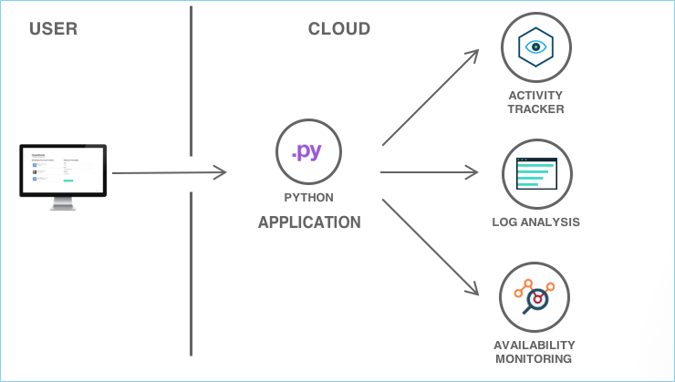
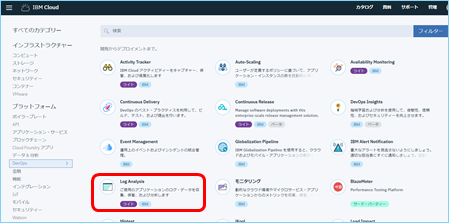
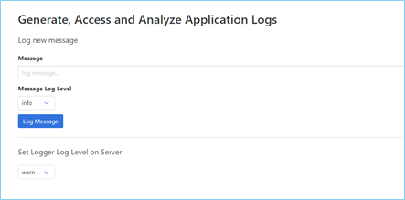
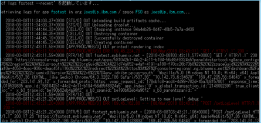
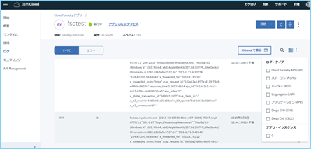

# Analyze logs and monitor health of a Cloud Foundry application
- このチュートリアルでは、**IBM Cloud Log Analysis** を利用してIBM Cloud上にデプロイされたCloud Foundryアプリケーションの状態を把握する方法を学びます。ここでは、Python ランタイムから出力される様々なタイプのログをIBM Cloud Log Analysisで提供されるApache Kibanaを利用して解析します。さらにAvailability Monitoringサービスを利用して、アプリケーションの状態を動的にチェックする方法を学びます


## チュートリアルの目的
- IBM Cloud Log Analysis/Availability Monitoringサービスのプロビジョニング
- アプリケーションログの取得方法／ログ解析／ログの可視化方法の理解
- 通知サービスの利用


## 利用製品／サービス
- [IBM Cloud Log Analysis](https://console.bluemix.net/catalog/services/log-analysis)
- [Python](https://console-regional.ng.bluemix.net/catalog/starters/python)
- [Availability Monitoring](https://console.bluemix.net/catalog/services/availability-monitoring)
- [Activity Tracker](https://console.bluemix.net/catalog/services/activity-tracker)

## アーキテクチャ


- ユーザーはPythonアプリケーションとアクセスする
- Pythonアプリケーションはログを出力する
- Log Analysisでログを解析する
- Availability Monitoringでアプリケーションの状況を監視する

## Log Analysisサービスのプロビジョニング
　基本的にIBM Cloudの診断用出力（例：ログ）は追加のサービスを利用することなくアクセスすることが可能ですが、様々なソースのログにアクセスして解析するにはそれぞれのサービスコンソールへとアクセスする必要があります。Log Analysisサービスは様々なソースをまとめて取得することができるため障害時をふくめた状況確認の際に有効です。
　ここではまず初めに、Log Analysisサービスのプロビジョニングを実施します。

1. カタログページにて **DevOps** から **Log Analysis** を選択します。

2.  表示されたLog Analysisの画面で適切な地域／ロケーション・組織・スペースを選択し、**作成** をクリックします。
3. Log Analysis 開始画面が表示されます。
``サービス名はランダムで付与されますが、後から変更することも可能です``

## Pythonアプリケーションのデプロイ
続いてログを出力するPythonアプリケーションをデプロイします。このチュートリアルではすでに完成して実行可能なモジュールをGithubリポジトリからローカル環境ダウンロードして、IBM CloudにPushします。

1. GitHubのリポジトリから、サンプルのアプリケーションをCloneします。
```bash
git clone https://github.com/IBM-Cloud/application-log-Analysis
```
``Cloneの際GitHubへのユーザー登録が必要となります。登録がない場合は登録してCloneを実施してください``

2. Cloneされたアプリケーションのプロジェクトルートディレクトリへと移動します。
```bash
cd application-log-analysis
```
3. IBM CloudへCloneされたアプリケーションをPushします。アプリケーション名は任意です。
```bash
bx login
…(ログイン処理)…
bx target –cf
…(ターゲットスペース設定処理)…
bx cf push <アプリケーション名>
…(アプリケーションのPush処理)…
```

## アプリケーションログの生成
　続いてアプリケーションのログを生成します。GitHubからCloneしたPythonアプリケーションをIBM CloudにPushする際にもログは生成されていますが、今回のチュートリアル用に明示的にログを生成します。
　なお、PythonアプリケーションをIBM Cloudにデプロイした際に自動的にLog Analysisサービスへとリンクが生成されるため、他のIBM Cloud サービスのように明示的に接続（バインド）する必要はありません。

1. デプロイしたアプリケーションにブラウザからアクセスします。アクセスするURLは[IBM Cloud dashboard(console)](https://console.bluemix.net/dashboard/apps)の、Pushしたアプリケーションのエントリに表示されています。
2. 表示されたアプリケーションではログの生成と、サーバー側のログ保存レベルが設定できます。後のチュートリアル用にいくつかのログを生成しておきます。


## アプリケーションログの表示
　IBM Cloud環境では、Cloud Foundryアプリケーションのログにアクセスする方法がいくつかあります。基本的に各アプリケーションごとにログを表示させることになります。

1. 1つ目はコマンドラインでの表示となります。ログイン後、次のコマンドでアプリケーションのログが表示されます。
```bash
bx cf logs <アプリケーション名> --recent
```


2. ２つ目は、IBM Cloud Console を利用する方法です。ログを表示したいアプリケーション画面を表示後、左側ペインの　**ログ** リンクをクリックするとアプリケーションのログが表示されます。ログについては、フィルタリングすることも可能です。


3. IBM Cloud Log Analysisはこれら２つに比べて、より長期間のログが保存可能であり、また１つのダッシュボードで複数のアプリケーションログを見ることができます。
