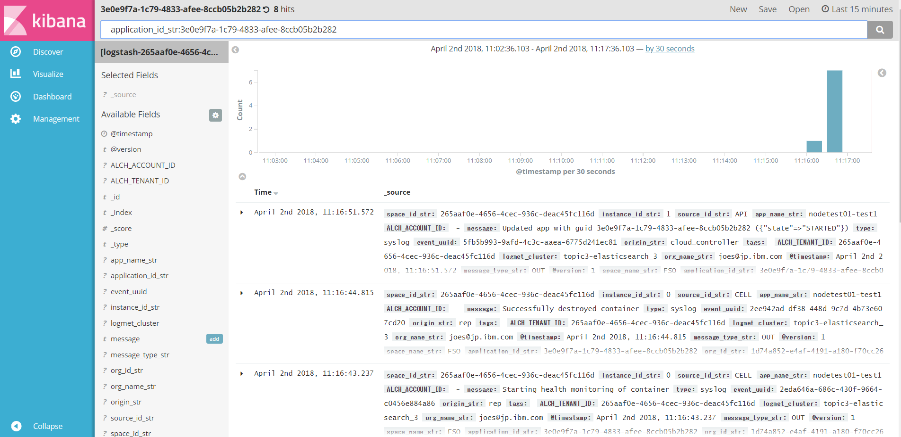
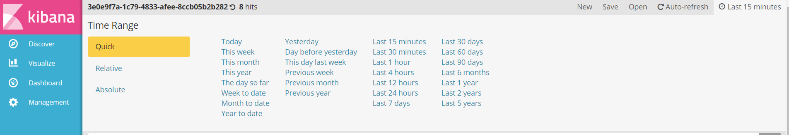
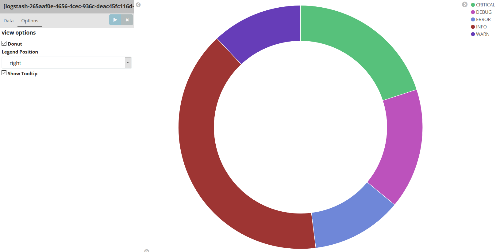
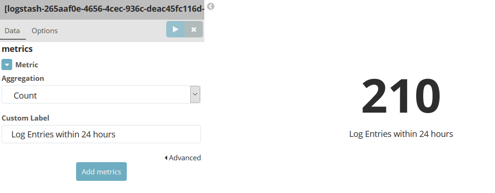
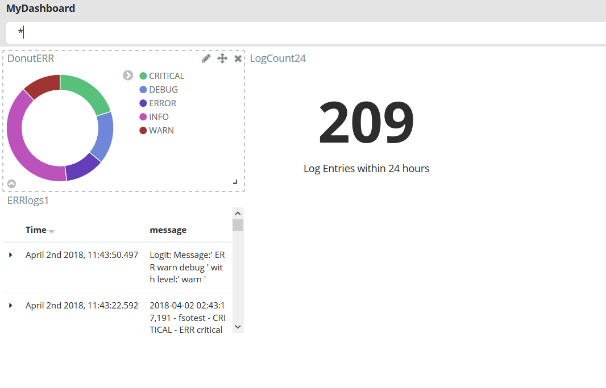

# Analyze logs and monitor health of a Cloud Foundry application
- このチュートリアルでは、**IBM Cloud Log Analysis** を利用してIBM Cloud上にデプロイされたCloud Foundryアプリケーションの状態を把握する方法を学びます。ここでは、Python ランタイムから出力される様々なタイプのログをIBM Cloud Log Analysisで提供されるApache Kibanaを利用して解析します。さらにAvailability Monitoringサービスを利用して、アプリケーションの状態を動的にチェックする方法を学びます


## チュートリアルの目的
- IBM Cloud Log Analysis/Availability Monitoringサービスのプロビジョニング
- アプリケーションログの取得方法／ログ解析／ログの可視化方法の理解
- 通知サービスの利用


## 利用製品／サービス
- [IBM Cloud Log Analysis](https://console.bluemix.net/catalog/services/log-analysis)
- [Python](https://console-regional.ng.bluemix.net/catalog/starters/python)

## アーキテクチャ


- ユーザーはPythonアプリケーションとアクセスする
- Pythonアプリケーションはログを出力する
- Log Analysisでログを解析する

## Log Analysisサービスのプロビジョニング
　基本的にIBM Cloudの診断用出力（例：ログ）は追加のサービスを利用することなくアクセスすることが可能ですが、様々なソースのログにアクセスして解析するにはそれぞれのサービスコンソールへとアクセスする必要があります。Log Analysisサービスは様々なソースをまとめて取得することができるため障害時をふくめた状況確認の際に有効です。
　ここではまず初めに、Log Analysisサービスのプロビジョニングを実施します。

1. カタログページにて **DevOps** から **Log Analysis** を選択します。

2.  表示されたLog Analysisの画面で適切な地域／ロケーション・組織・スペースを選択し、**作成** をクリックします。
3. Log Analysis 開始画面が表示されます。
``サービス名はランダムで付与されますが、後から変更することも可能です``

## Pythonアプリケーションのデプロイ
続いてログを出力するPythonアプリケーションをデプロイします。このチュートリアルではすでに完成して実行可能なモジュールをGithubリポジトリからローカル環境ダウンロードして、IBM CloudにPushします。

1. GitHubのリポジトリから、サンプルのアプリケーションをCloneします。
```bash
git clone https://github.com/IBM-Cloud/application-log-Analysis
```
``Cloneの際GitHubへのユーザー登録が必要となります。登録がない場合は登録してCloneを実施してください``

2. Cloneされたアプリケーションのプロジェクトルートディレクトリへと移動します。
```bash
cd application-log-analysis
```
3. IBM CloudへCloneされたアプリケーションをPushします。アプリケーション名は任意です。
```bash
bx login
…(ログイン処理)…
bx target –cf
…(ターゲットスペース設定処理)…
bx cf push <アプリケーション名>
…(アプリケーションのPush処理)…
```

## アプリケーションログの生成
　続いてアプリケーションのログを生成します。GitHubからCloneしたPythonアプリケーションをIBM CloudにPushする際にもログは生成されていますが、今回のチュートリアル用に明示的にログを生成します。
　なお、PythonアプリケーションをIBM Cloudにデプロイした際に自動的にLog Analysisサービスへとリンクが生成されるため、他のIBM Cloud サービスのように明示的に接続（バインド）する必要はありません。

1. デプロイしたアプリケーションにブラウザからアクセスします。アクセスするURLは[IBM Cloud dashboard(console)](https://console.bluemix.net/dashboard/apps)の、Pushしたアプリケーションのエントリに表示されています。
2. 表示されたアプリケーションではログの生成と、サーバー側のログ保存レベルが設定できます。後のチュートリアル用にいくつかのログを生成しておきます。


## アプリケーションログの表示
　IBM Cloud環境では、Cloud Foundryアプリケーションのログにアクセスする方法がいくつかあります。基本的に各アプリケーションごとにログを表示させることになります。

1. 1つ目はコマンドラインでの表示となります。ログイン後、次のコマンドでアプリケーションのログが表示されます。
```bash
bx cf logs <アプリケーション名> --recent
```


2. ２つ目は、IBM Cloud Console を利用する方法です。ログを表示したいアプリケーション画面を表示後、左側ペインの　**ログ** リンクをクリックするとアプリケーションのログが表示されます。ログについては、フィルタリングすることも可能です。


3. IBM Cloud Log Analysisはこれら２つに比べて、より長期間のログが保存可能であり、また１つのダッシュボードで複数のアプリケーションログを見ることができます。またログの検索、ブラウザーベースUI(Kibana dashboard)での視覚化も可能になります。使用するには、[IBM Cloud dashboard(console)](https://console.bluemix.net/dashboard/apps)で対象のアプリケーションのエントリを開き、**ログ** > **Lonamaで表示** をクリックします。詳細については[IBM Cloud Log Analysisの該当部分資料](https://console.bluemix.net/docs/services/CloudLogAnalysis/kibana/analyzing_logs_Kibana.html#launch_Kibana)

## ログの検索とフィルタリング
  IBM Cloud Log Analysis/Kibanaのダッシュボードはデフォルトでは過去15分間の表示可能なログすべてが表示されます。表示されているバーチャートは、最新15分間での30秒ごとのメッセージのカウント数となります。このセクションではこれを変更して保存します。

1. Kibana dashbord画面左側列に、利用可能なフィールドが表示されています。左側フィールドで **message** > **add** を選択します。


2. 表示期間を変更するには、画面右上の **Last 15 minutes** という文字のリンクをクリックします。表示されたTime Rangeで **Last 24 hour** を選択し、**Save** をクリックして保存します。


3. 続いて更新間隔を変更します。表示期間設定タブの **Auto-refresh** リンクをクリックしてください。デフォルトでは **Off** に設定されていますので　**5 minutes** に変更します。

4. 検索フィールドに検索文字列を設定します。ここでの設定にしたがってメッセージがフィルタリングされます。文字列は以下のようにします。
```bash
message:(CRITICAL|INFO|ERROR|WARNING|DEBUG) && message_type_str:ERR
```

5. **Save** をクリックして構成を保存します。このチュートリアルでは名前は **ERRlogs** とします。

## ログのグラフ化
　続いてログのグラフ化の設定を行います。

1. Kibana dashboardの左側ペインから **Visualize** を選択します。
2. **Pie Chart** を選択します。
3. Filterに作成した ***ERRlogs*** を選択します。
4. **Select buckets type** にて **Split Slices** を選択し、**Aggregation** で **Filters** を選択します。
5. **Filter 1～5** に、それぞれ **CRITICAL,ERROR,WARN,INFO,DEBUG** を追加します。


6. **Options** タブの **View options** で、**Donut** にチェックをつけます。
7. 最後に **Play アイコン(右向き矢印)** をクリックします。次のようなチャートが表示されます。


8. 最後に **Save** をクリックして **DonutERR** という名前でグラフを保存します。

## メトリックの作成
　続いてメトリックを表示する設定を実施ます。

1. **Visualize** を表示し、**Metric** をクリックします。
2. **[logstach-** で始まるログをクリックします。
3. **Metric** を開き、**Custom Label** に ***Log Entries within 24 hours*** を設定し、**Play アイコン(右向き矢印)** をクリックします。

4. 最後に **Save** をクリックして、 ***LogCount24*** という名前でメトリックを保存します。


## ダッシュボードの利用
　最後に、ダッシュボードを使用して作成したグラフ／メトリックを一度に表示する画面を作成します。

1. Kibana dashboardの左側ペインから **Dashboard** を選択します。
2. 表示された画面で **add** ボタンをクリックします。
3. 作成したグラフやメトリック、またログそのものなどを選択し表示させます。表示場所については任意の場所に移動させることができます。


4. 最後に最後に **Save** をクリックして、 ***MyDashbord*** という名前でメトリックを保存します。これを利用していつでも今回作成したダッシュボードを呼び出すことができます。

---

これでこのチュートリアルは終了です。
