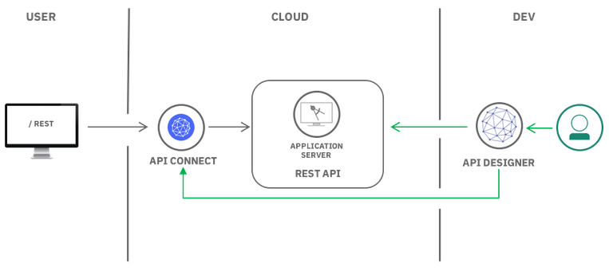
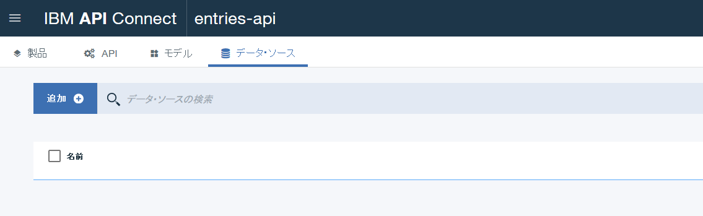
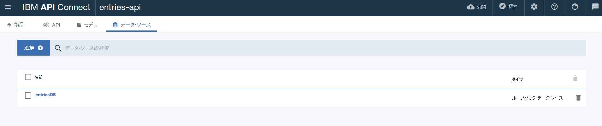
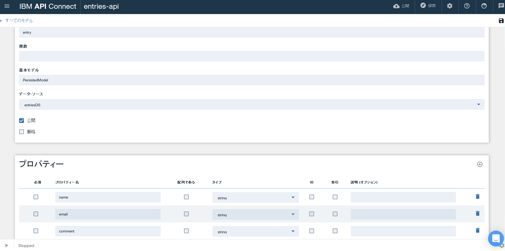
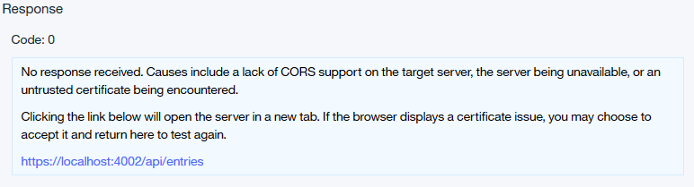
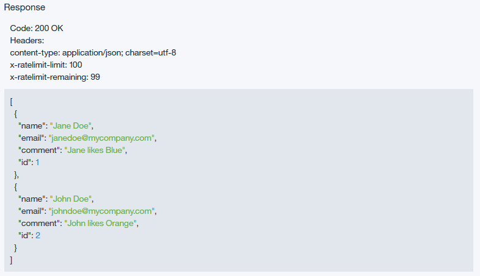

# Create, secure and manage REST APIs
　このチュートリアルでは、LoopBack Node.js API フレームワークを理湯押してREST APIを作成し、IBM Cloud上の **API Connect** サービスを利用して、作成したAPIの管理や可視化、セキュリティー設定の追加やレート制限を設定します。

## チュートリアルの内容
- Node.js を利用した REST API の作成
- Node.js アプリケーションのデプロイ
- API Specificationを　API Connectにインポート
- API の管理とセキュリティー設定

## 利用製品／サービス
- [LoopBack](https://loopback.io/)
- [API Connection](https://console.bluemix.net/docs/services/apiconnect/index.html)
- [SDK for Node.js](https://console.bluemix.net/catalog/starters/sdk-for-nodejs) Cloud Foundry App

## アーキテクチャ


## チュートリアル開始前に
　このチュートリアルでは[Node.js](https://nodejs.org/en/download/)を利用します。開始前にNode.jsをダウンロードしインストールしておいてください。

## Node.js で　REST API を作成する
　このセクションでは、[LoobBack framework](https://loopback.io/doc/index.html) を利用してNode.js上にAPIを作成します。LoopBackはコードをほとんど作成せず（もしくは全く作成せず）に 動的なend-to-end REST APIを作成できる、オープンソースのNode.jsフレームワークです。

### アプリケーションの作成
1. IBM API Connect コマンドラインツールをローカルマシンに導入します。
```bash
npm install -g apiconnect
```
2. 次のコマンドを入力してアプリケーションを作成します。
```bash
apic loopback
```
途中でライセンス確認等のプロンプトが出る場合がありますが、問題なければはい、もしくはYesを選択して進んでください。
3. アプリケーションの名前に``entries-api`` と設定し **Enter** を押します。
4. プロジェクト名と同じディレクトリを利用するためディレクトリ名設定では **Enter** を押します。
5. LoopBackの **現在** のバージョンを選択します。
6. アプリケーションのタイプでは **empty-server** を選択します。
7. npm installが実行され必要な依存関係がインストールされます。インストールが問題なく完了すればアプリケーションの作成は完了です。

### データソースの追加
　アプリケーションのデータを保管するためにデータソースを構成します。様々なタイプのデータベースがサポートされていますが、このチュートリアルでは簡易化のためにインメモリデータベースを利用します。

1. ディレクトリを作成した entries-apiに変更し、APIデザイナーを起動します。
```bash
cd entries-api
apic edit
```
途中でIBM Cloudへのサインインを求められた場合、あらかじめ登録済みのアカウントを利用してサインインします。
2. ブラウザ上にAPI デザイナーが表示されます。上部メニューの **データ・ソース** をクリックし、**追加+** をクリックします。

3. **新規ループバック・データ・ソース** 作成ダイアログを表示させ、***entriesDS*** と入力し **新規作成** をクリックします。
4. コネクターに in-memory db が選択されていることを確認し、**すべてのデータ・ソース** をクリックして初期画面に戻ります。ループバック・データ・ソースが追加されていることを確認してください。


### モデルの追加
　モデルは、APIのデータ構造／スキーマを定義しコントロールできます。

1. API デザイナー画面で、**モデル** をクリックし、**追加+** をクリックします。
2. **新規ループバック・モデル** 作成ダイアログを表示させ、***entry*** と入力し、**新規作成** をクリックします。
3. 表示された画面で、データ・ソースに ***entriesDS*** を選択し、プロパティセクションで **+** をクリックして以下のプロパティを追加ます（３つ)
  - プロパティ名： ***name*** タイプ： ***string***
  - プロパティ名： ***email*** タイプ： ***string***
  - プロパティ名： ***comment*** タイプ： ***string***
  
4. 設定後、画面右上の **Save** アイコンをクリックします。
5. 画面左上の **すべてのモデル** をクリックして初期画面に戻ります。ループバック・モデルが追加されていることを確認してください。

## アプリケーションのテスト
　続いてローカル環境のLoopbackアプリケーションをを開始し、APIデザイナーを利用してAPIのテストを実施します。

1. APIデザイナー画面下部のスタートアイコンをクリックして、**Running** になるまで待ちます。

2. 画面右上の **探索** をクリックしAPI デザイナー Exploreツールを表示させます。ツールの左側にはLoopbackモデルで実行可能なすべてのRESTオペレーションが表示されています。
3. **entry.create** オペレーションを選択します。画面中央には、エンドポイント／パラメータ／セキュリティ／モデルインスタンスデータ／レスポンスコードなどの情報がまとめて表示さｒ低ませう。画面右かがには、cURLやRuby、Python、Java、Nodeでこのオペレーションを実行する場合のテンプレートコードが表示されています。
4. 画面右側で **Try it** リンクをクリックします。**Parameters** セクションの **data** 入力域に次のデータを設定します。
```bash
{
  "name": "Jane Doe",
  "email": "janedoe@mycompany.com",
  "comment": "Jane likes Blue"
}
```
5. **Call operation** ボタンをクリックします。POSTが成功し、レスポンスコードが **200 OK** であることを確認してください。
  - レスポンスコードが200ではなく、メッセージとしてCORSサポートの欠落が表示された場合、メッセージのリンクをクリックして使用しているブラウザに証明書を取り込んだのち、再度 **Call operation** ボタンをクリックしてください。
  
6. curlコマンドを利用して別のエントリを追加します。
```bash
curl --request POST \
--url https://localhost:4002/api/entries \
--header 'accept: application/json' \
--header 'content-type: application/json' \
--header 'x-ibm-client-id: default' \
--header 'x-ibm-client-secret: SECRET' \
--data '{"name":"John Doe","email":"johndoe@mycomany.com","comment":"John likes Orange"}' \
--insecure
```
curlが利用できない場合、以下のデータを4.の方法で設定しCall operationボタンを利用してデータを投入してください
```bash
{
  "name": "John Doe",
  "email": "johndoe@mycompany.com",
  "comment": "John likes Orange"
}
```
7. 画面左側で **entry.find** を選択し、画面右側で **Try it** をクリック後、**Call operation** をクリックします。レスポンスとして200 OKが戻り、次の情報が表示されることを確認してください。


## API Connectサービスの作成
　次のステップの準備としてIBM Cloud上にAPI Connectサービスを作成します。API Connectサービスは作成したAPIのゲートウェイとして動作し、管理／セキュリティー設定／レートの設定ができます。

1. [カタログページ](https://console.bluemix.net/catalog/)にて　**API** から **API Connect** を選択します。
2. サービス名に任意の名前を入力し、適切な地域／ロケーション・組織・スペースを選択後、**作成** をクリックします。

## IBM CloudへAPIをデプロイする
