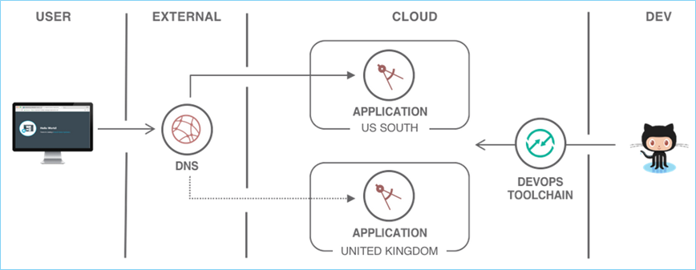
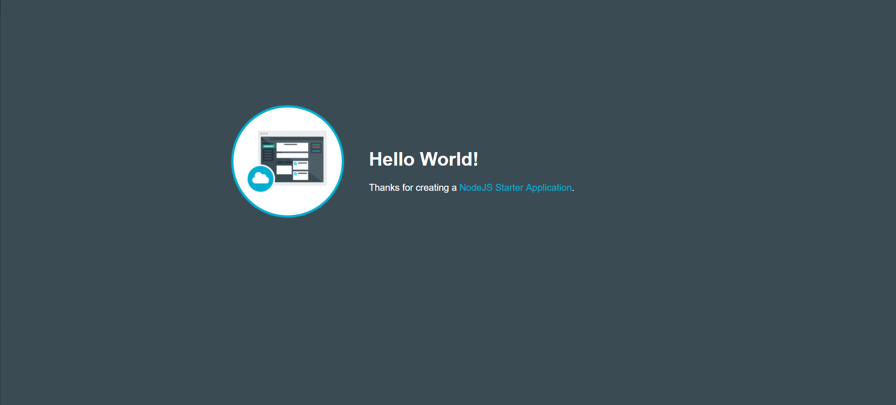
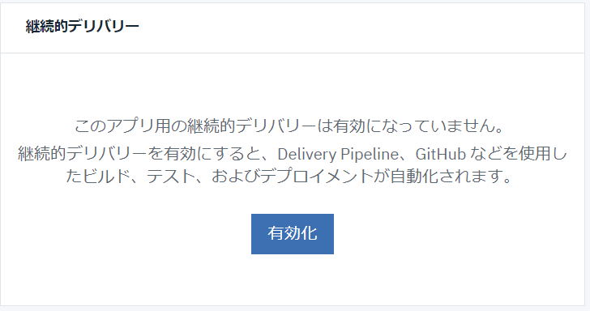
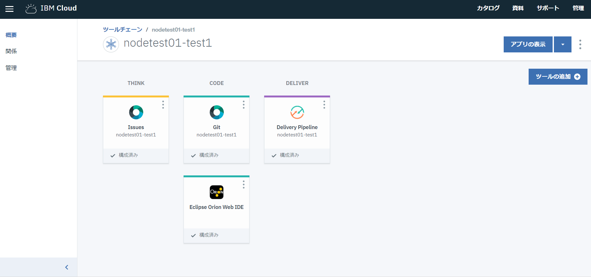
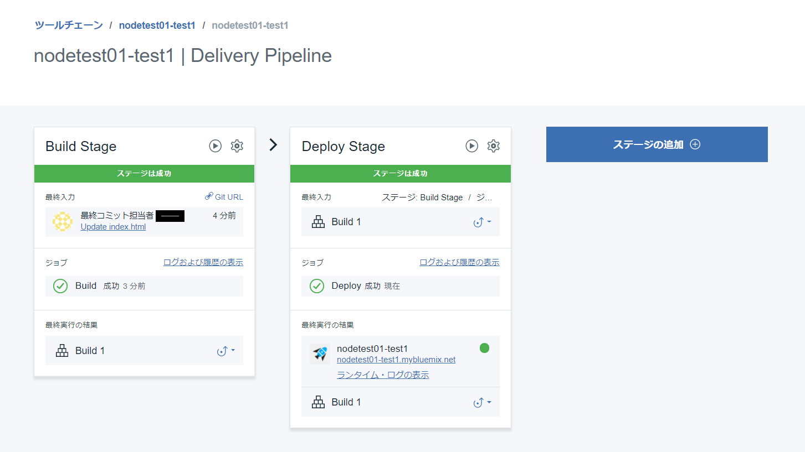
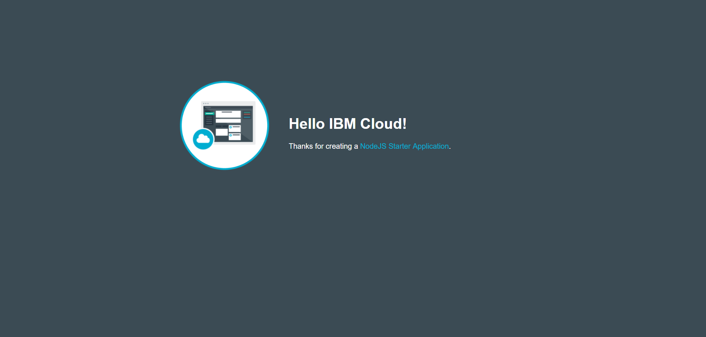

# Deploy a secure web application across multiple regions
- このチュートリアルでは、**continuous delivery pipeline** を利用して、複数リージョンにまたがるWebアプリケーションをセキュアに作成し、デプロイする方法を学びます。

## チュートリアルの目的
- ソース管理とcontinues deliveryのセットアップ
- 複数リージョンへとWebアプリケーションをデプロイ
- アプリケーションにカスタムドメインをマップ
- SSL証明書をアプリケーションにバインドする
- アプリケーションのパフォーマンスをモニターする


## 利用製品／サービス
- [SDK for Node.js](https://console.bluemix.net/catalog/starters/sdk-for-nodejs)
- [Continuous Delivery Service for DevOps](https://console.bluemix.net/catalog/services/continuous-delivery)


## アーキテクチャ


このチュートリアルでは、２つのことなる地域に同じアプリケーションを配置し、Active/Standby方式でサービスを提供する方法について記述しており、Active側アプリケーションに不具合がおきてアクセス不能になった場合、手動で別の地域へと経路を変更することを想定しています。

DNSプロバイダーによっては、障害が検知された場合に自動的に経路を変更することのできるものもあります。また、グローバル・ロード・バランサーをアプリケーション前段に配置し、アプリケーションのトラフィックを２つに地域に分散する構成も考えれます。これらの構成についてはこのチュートリアルでは記述していません。

## Node.jsアプリケーションの作成

1. [カタログページ](https://console.bluemix.net/catalog/?taxonomyNavigation=apps&category=cf-apps)にて **Cloud Foundryアプリ** から **SDK fo Node.js** を選択します.
2. アプリケーションに任意の名前を付け（例： *nodetest01* ) **作成** ボタンをクリックします。
3. アプリケーション開始後、**概要** ページの **アプリURLにアクセス** リンクをクリックして画面を表示させます。


この単純なアプリケーションを今回利用します。

## ソース管理と継続的デリバリーのセットアップ
ここでは、コードを保管するためのGit リポジトリをセットアップし、その後コード変更時に自動的にデプロイを実行するためのデリバリー・パイプラインを作成します。

1. 作成したCloud Foundryアプリケーションの **概要** ページを開きます。画面下部に表示されている **継続的デリバリー** のパネルで **有効化** をクリックし、継続的デリバリーを利用可能にします。


2. 表示された **Continuous Deliveryツールチェーン** 画面で、デフォルト設定のまま **作成** をクリックします。


3. **CODE** 列の　**Git** パネルをクリックします。自分自身のGit リポジトリが表示されます。
``SSH keyの設定がまだ済んでいない場合、ページ上部に通知が表示荒されます。指示に従ってSSH keyの追加をするかHTTPSでの通信をセットアップしてください。``
4. SSHかHTTPSを使って、ローカルマシンにGit リポジトリ上のソースコードをcloneしてください。
```bash
git clone <your_repo_url>
cd <name_of_your_app>
```
**注：** Git リポジトリのURLは、Git リポジトリページの中央付近に表示されているものです。
5. ローカルマシンにcloneされたソースコードを編集し、アプリケーションを変更します。publicディレクトリのindex.htmlの中身を書き換えます。（例："*Hello World*"を"*Hello IBM Cloud*"）
6. ローカルマシンで編集したアプリケーションを実行します。以下のコマンドを順番に実行してください。
```bash
npm install
npm build
npm start
```
7. ブラウザで *localhost:<port>* にアクセスし、変更したアプリケーションが表示されることを確認します。
8. 変更をGit リポジトリにPushします。以下のコマンドを順番に実行してください。
```bash
git add public/index.html
git commit -m "my first changes"
git push origin master
```
9. **Continuous Deliveryツールチェーン** 画面に戻り、**DELIVER** 列の **Delivery Pipeline** パネルをクリックします。以下のような画面が表示されます。（注： **DEPLOY** ステージが完了していない場合、完了までしばらく待ちます）

10. アプリケーションURLをクリックし、デプロイ結果を確認します。変更されたソースが反映され、アプリケーションが変更されていることを確認してください。


引き続き何度かソースの変更／Pushを繰り返し、自動的にアプリケーションがデプロイしなおされることを確認してください。

## 別の地域へのデプロイ
