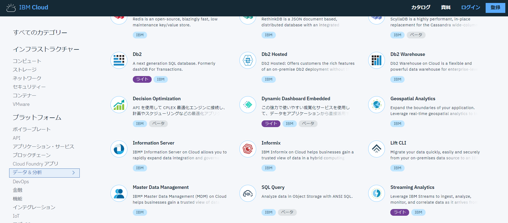
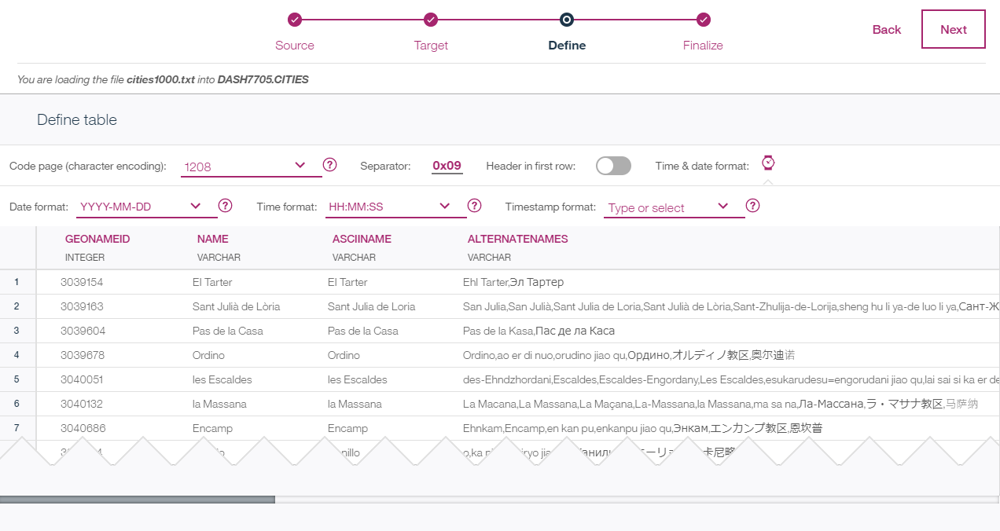
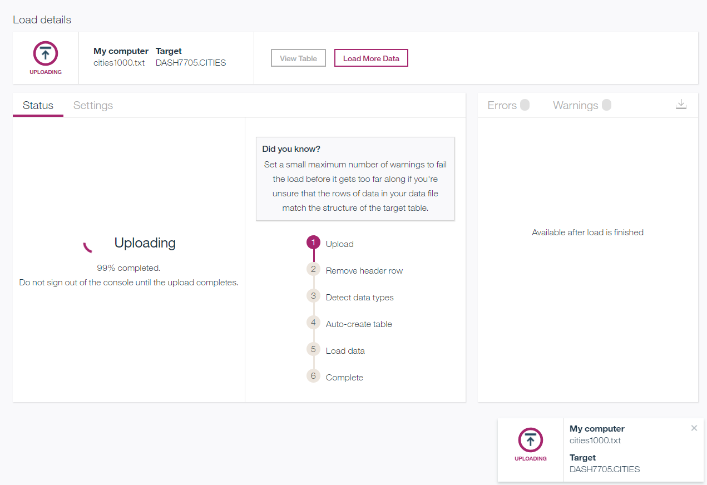

# SQL Database for Cloud
- このチュートリアルでは、SQL(relational)データベースサービスをプロビジョニングし、テーブルを作成し、サイズの大きなデータをデータベースにロードする方法を紹介します。ロードしたデータを取得して表示させるPythonアプリケーションのデプロイも行います。

## チュートリアルの内容
- SQLデータベースのプロビジョニング
- データベーススキーマ（テーブル）の作成
- データのロード
- Credentialを共有してアプリケーションとデータベースサービスを接続する
- 監視、セキュリティ、バックアップ＆リカバリーについて

## 利用製品／サービス
- [Db2 Warehouse](https://console.bluemix.net/catalog/services/db2-warehouse)

## チュートリアル開始前に
　このチュートリアルではデータセットとして世界の都市の人口データを利用します。[GeoNames](http://www.geonames.org/)サイトから[citeis1000.zip](http://download.geonames.org/export/dump/cities1000.zip)ファイルをあらかじめダウンロードしておいてください。

## SQL Databaseのプロビジョニング
まず [**Db2 Warehouse**](https://console.bluemix.net/catalog/services/db2-warehouse) サービスをプロビジョニングします。

1. [カタログページ](https://console.bluemix.net/catalog/?taxonomyNavigation=apps&category=data)にて　**データ＆分析**　から　**Db2 Warehouse** を選択します.

2. 価格プランにて **Entry** を選択し、作成します。サービス名は任意のもの（例：*sqldatabase*）に設定し、地域／組織／スペースを確認して **作成** をクリックします。
3. 作成が完了するとDashboardが開きます。**Open** をクリックしてdatabase consoleを表示させます。

## テーブル作成
1. console画面にて **Explore** リンクをクリックします。スキーマ名が *DASH* で始まる行を探し、クリックします。
2. **+New Table** をクリックします。テーブル名に ***CITIES*** と設定し、カラム設定に[cityschema.txt](https://github.com/IBM-Cloud/cloud-sql-database/blob/master/cityschema.txt)ファイルからコピーしたカラムの設定を張り付けて **Create** をクリックします。

## データのロード
　CITIESテーブルを作成したのちに、データをテーブルにロードします。ロードするデータはあらかじめダウンロードしたファイルを利用します。

1. console画面にて **Load** ボタンをクリックします。データソースとして **My computer** を選択します。この画面ではLocalのMy computerだけでなく、Amazon S3やIBM Cloud Infrastracture Service上のObject Strageサービスからもデータをロードできます。また[Lift](https://console.bluemix.net/catalog/services/lift)移行サービスを利用してデータをロードすることも可能です。これらの方法以外で大量のデータをロードする必要がある場合は、[mail-in drive](https://www.ibm.com/support/knowledgecenter/SS6NHC/com.ibm.swg.im.dashdb.doc/learn_how/load_mail_in_drive.html)サービスを利用することも可能です。
2. **File Selection** 領域で **browse file** リンクをクリックし、あらかじめダウンロードしておいた *cities1000.txt* ファイルを選択します。
3. **Next** をクリックしてロード先を選択する画面を表示させます。先ほど作成したCITIESテーブルを選択し **Next** をクリックします。
4. データの読み込み規則を設定する **Define table** 画面が開きます。次の設定を実施します。
  - **Header in first row:** を ***Off***
  - **Separator:** を ***0x09***
  - **Date format:** を　***YYYY-MM-DD***
  - **Time format:** を　***HH:MM:SS***
5. 設定後の画面は以下のようになります。**Next** をクリックします。

6. 設定のレビュー画面が表示されます。問題ないことを確認して **Begin Load** をクリックします。データのロードが開始します。次のような画面が表示されてロードされます。（少し時間がかかります）


## SQLを使用したデータの表示
　続いて、ロードしたデータをSQLを利用して表示します。

1. console画面にて **Run SQL** をクリックします。ここでは、SQLステートメントを実行できるSQL Editorが開きます。なお、ローカルPC上のSQLツールを利用してSQLを実行する場合は画面右上部のアカウント名の左側にあるアイコンをクリックし、**Connection inf** メニューを選択して表示される画面に従い、ドライバーなどをダウンロードして利用してください。
2. **SQL Editor** 画面に次のコマンドを入力します。
```bash
select count(*) from cities
```
入力後、**Run All** ボタンをクリックします。画面下部の結果表示部にSQL実行結果が表示されます。

3. **SQL Editor** 画面に次のコマンドを入力します。
```bash
select countrycode, count(name) from cities
group by countrycode
order by 2 desc
```
4. **SQL Editor** 領域で入力したコマンドを選択後、**Run Selected** ボタンをクリックします。選択したSQLのみが実行され、結果が表示されます。

## データ表示用アプリケーションのデプロイ

## データ表示用アプリケーションでのデータ表示

## 監視、セキュリティー、バックアップ＆リカバリーについて
