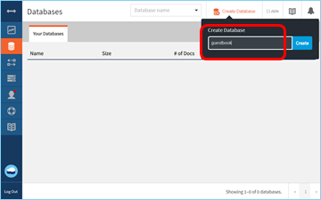
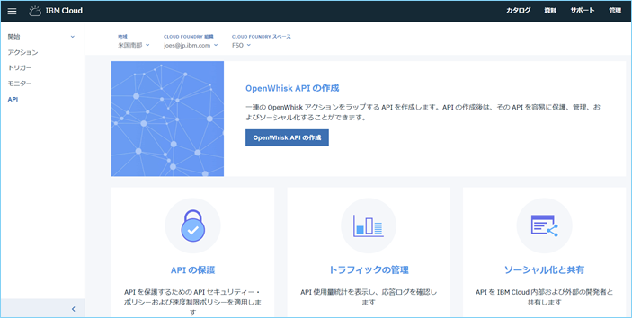

# Serveless web application and API
- このチュートリアルでは、GitHubページに静的なコンテンツを配置し、Cloud Functionsを利用してIBMCloud 上のデータベースにデータを保存するWebサイトを作成します。

## チュートリアルの内容
- 操作にServelessを利用するバックエンドデータベースのデプロイ
- REST APIの公開
- 静的Webサイトの公開

## 利用製品／サービス
- [Cloudant No SQL DB](https://console.bluemix.net/catalog/services/cloudantNoSQLDB)

- [Cloud Functions](https://console.bluemix.net/openwhisk/)

## アーキテクチャ


1. ユーザーはGitHub Pagesでホストされる静的Webページへとアクセスする
2. Webページ（アプリケーション）はバックエンドのAPIを呼び出す
3. バックエンドのAPIはAPI Gatewayで定義されている
4. API GatewayはCloud Functionsへリクエストを転送する
5. Cloud FunctionsはCloudantへデータを格納する

## チュートリアル開始前に
　このチュートリアルでは GitHub上のページをWebサイトとして利用します。このためチュートリアルを完了させるためには GitHub のアカウントを所持している必要があります。

## Cloudant NoSQL Databaseの作成
　始めにCloudant NoSQL Database上に今回利用する*Guestbook*データベースを作成します。Cloudant NoSQL DBはModern Web/モバイルようにデザインされており、JSONスキーマを利用した柔軟なデータ管理が可能です。またApache Couch DBと互換性があり、セキュアなHTTPS APIを利用してアクセスが可能なデータベースです。


1. カタログページにて**データ＆分析**から**Cloudant NoSQL DB**を選択します.
2. サービス名に ***guestbook-db*** を設定し、任意のスペースにデプロイします。
3. **サービス資格情報** にて **新規資格情報** を追加します。
4. **管理** ページの **Launch** ボタンをクリックしてCloudant Service consoleを表示させます。
5. ***guestbook*** という名前でデータベースを作成します。




## Cloud Functionsアクションの作成
　IBM Cloud Functions にてServerless アクションを作成します。IBM Cloud Functions は発生したイベントに応じて機能が実行される実行Apache OpenWhiskをベースにしたFunction-as-a-Service(FaaS)です。IBM Cloud Functionsでは、いくつかのアクションをまとめてシーケンスと呼ばれるアクショングループを作成することも可能です。シーケンスは、1つのアクションのアウトプットを、次のアクションのインプットとする実行の単位となります。


### *guestbook* 登録シーケンスの作成
最初に作成するシーケンスは、以下のアクションを実行します。
* *guestbook* 登録用のドキュメント（文書）を作成します。
* 作成したドキュメントをCloudant NoSQL databaseに保管します。


1. [IBM Cloud Functions](https://console.bluemix.net/openwhisk)画面を表示します
2. 左側ペインで、**アクション** をクリックし **作成** をクリックします。
3. **アクションの作成** をクリックします。
4. アクション名に、***prepare-entry-for-save*** を設定し、ランタイムに **Node.js 6** を設定したのち **作成** をクリックします。
5. デフォルトのコードを下のコードに置き換えて、Edit modeを抜けます（Escを押す）
```js
/**
 * Prepare the guestbook entry to be persisted
 */
function main(params) {
  if (!params.name || !params.comment) {
    return Promise.reject({ error: 'no name or comment'});
  }

  return {
    doc: {
      createdAt: new Date(),
       name: params.name,
       email: params.email,
       comment: params.comment
    }
  };
}
```
6. **保存** をクリックします。
7. アクション保存後、左側ペインの **エンクロージング・シーケンス** をクリックし、**シーケンスに追加** をクリックします。
8. アクション名に ***save-guestbook-entry-sequence*** と設定し、その他はデフォルトのまま **作成＆追加** をクリックします。
9. 作成されたシーケンスが表示されます。
（表示されない場合「F5」キー等を利用して画面をリフレッシュします）
10. ***save-guestbook-entry-sequence*** リンクをクリックします。

　引き続きシーケンスを作成します。IBM Cloud Functionsではあらかじめいくつかのアクション／シーケンスがパブリックパッケージとして用意されており、今回は用意されたCloudant用パッケージを利用してデータをCloudant NoSQL DB へ保存します。

11. 表示されたシーケンス画面で **追加** をクリックします。
12. アクションの追加画面で、**パブリックの使用** を選択し **Cloudant** を選択します。
13. アクションに **create-document** を選択後、以下のパラメータを選択／設定し **追加** をクリックします。
  - **新規バインディング** を選択
  - 名前：**binding-for-guestbook**
  - インスタンス：**guestbook-db**
  - データベース：**guestbook**
  - その他はデフォルトのまま
14. シーケンス表示画面で「保存」をクリックし、作成したシーケンスを保存します。

　最後にこれまで作成したシーケンスを検証します

15. シーケンス画面で **入力の変更** をクリックします。
16. 表示されたポップアップ画面に、以下のコードを入力して **適用** をクリックします。
```json
    {
      "name": "John Smith",
      "email": "john@smith.com",
      "comment": "this is my comment"
    }
```

17. **起動** をクリックします。次のような結果が表示されることを確認します。


　ここまでの作業でCloudant NoSQL DBにデータを保管するシーケンスが作成されました。

### *guestbook* 登録文書取得シーケンスの作成
　引き続きシーケンスを作成します。このシーケンスは次のアクションを実行します。

* データベースに登録された文書をすべてリストアップする
* 文書を整形して返す


1. IBM Cloud Functions画面で、新規のNode.js 6 アクションを作成します。アクション名は ***set-read-input*** とします
2. アクションのコードを次の内容に変更して保存します。

```js
function main(params) {
  return {
    params: {
      include_docs: true
    }
  };
}
```

3. エンクロージング・シーケンス画面で **シーケンスに追加** をクリックし、新規にシーケンスを作成します。シーケンス名は、***read-guestbook-entries-sequence*** として **作成＆追加** をクリックします。
4. ***read-guestbook-entries-sequence*** をクリックし、**追加** をクリックしてアクションを追加します。（表示されない場合、F5キー等で画面をリフレッシュしてください）
5. アクションの追加画面で、**パブリックの使用** を選択し、Cloudantを選択します。
6. アクションに **list-documents** を選択し、マイ・バインディングに ***binding-for-guestbook*** を選択して **追加** をクリックします。
7. シーケンスに3つ目のアクションを追加します。表示されている ***read-guestbook-entries-sequence*** シーケンス画面で、**追加** をクリックします。
8. アクション名は ***format-entries*** とし、ランタイムは **Node.js 6** であることを確認して **作成＆追加** をクリックします。
9. シーケンス画面で作成した ***format-entries*** をクリックし、表示されたコードを次のコードに置き換えて保存します。

```js
const md5 = require('spark-md5');

function main(params) {
 return {
  entries: params.rows.map((row) => { return {
    name: row.doc.name,
    email: row.doc.email,
    comment: row.doc.comment,
    createdAt: row.doc.createdAt,
    icon: (row.doc.email ?　`https://secure.gravatar.com/avatar/${md5.hash(row.doc.email.trim().toLowerCase())}?s=64` : null)
  }})
 };
}

```
10. 左側ペインで「アクション」を選択し、***read-guestbook-entries-sequence*** をクリックして表示後 **保存** をクリックします。
11. **起動** をクリックして結果を確認します。次のような結果が表示されます


　ここまでの作業でCloudant NoSQL DBに保管されているデータを取得するシーケンスが作成されました。続いてこれまで作成したアクション／シーケンスをREST APIを利用して実行できるようにAPIの設定を行います。

## APIの作成
　IBM Cloud Functionsでは作成したアクション／シーケンスをREST APIとして公開できます。API作成後は、アクセスを制限するために認証を設定したり、呼び出し回数を制御することができます。また、APIの利用統計表示／応答ログの確認が容易にできるインターフェイスも用意されています。また、作成したAPIをIBM Cloud利用者／外部の利用者に公開することも可能になります


1. IBM Cloud Functions画面左側ペインで「アクション」を選択し、これまで作成したアクション、シーケンス一覧を表示させます。（デフォルト・パッケージセクションに表示されます）
2. ***read-guestbook-entries-sequence*** を選択し、表示された画面の左側ペインで **エンドポイント** をクリックします。
3. **Webアクション** セクションの **Webアクションとして有効化** チェックボックスにチェックを付けたのち **保存** をクリックします。
4. ***save-guestbook-entry-sequence*** についても同様に **Webアクションの有効化** をチェックし保存します。
5. アクション画面に戻り、2つのシーケンスのWebアクションが **有効** になっていることを確認します。
6. IBM Cloud Functions画面左側ペインで **API** を選択し管理画面を表示させます。
7. **OpenWhisk APIの作成** ボタンをクリックし、API定義画面を表示させます。
8. API名に ***guestbook***、APIの基本パスに ***/guestbook*** と設定後、**操作の作成** をクリックします。
9. **操作の作成** ポップアップ画面で、以下の設定をして **作成** をクリックします。
  - パス： /entries
  - Verb: GET
  - アクション： read-guestbook-entries-sequence
10. 再度 **操作の作成** ポップアップ画面を開き、以下の設定をして **作成** をクリックします。
  - パス： /entries
  - Verb： POST
  - アクション： save-guestbook-entries-sequence
11. API管理画面の **操作** セクションが次のようになっていることを確認し、画面最下部の保存をクリックします。


　ここまでの作業で作成したシーケンスをREST API経由で実行するWebアクションが作成されました。

``なおこのチュートリアルの例では、アクセス制御／速度制限等の設定は行っていないため、だれでもシーケンスを実行できる状態になっています。実際に利用される場合は、API定義画面で認証等の設定を実施してください。
``

## Webアプリケーションのデプロイ
　最後にWebアプリケーションを作成し、チュートリアルで作成したAPIを実行させます。


1. 自分のGitHubに https://github.com/IBM-Cloud/serverless-guestbook にあるコードを配置します。
2. **docs/guestbook.js** ファイル中 **apiUrl** を作成したAPIのパスに変更し、commitします。
3. 自分のリポジトリの設定ページにて **GitHub Pages** を表示させ、ソースを **master branch /docs folder** に変更して保存します。
4. 作成したWebページにアクセスします。あらかじめ登録されている"test"というエントリーがみつかるはずです。
5. 新規のエントリーを追加して動作を確認します。

---

これでこのチュートリアルは終了です。
