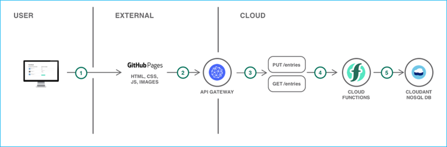

## Serveless web application and API
- このチュートリアルでは、GitHubページに静的なコンテンツを配置し、Cloud Functionsを利用してIBMCloud 上のデータベースにデータを保存するWebサイトを作成します。

### チュートリアルの目的
- 操作にServelessを利用するバックエンドデータベースのデプロイ
- REST APIの公開
- 静的Webサイトの公開

### 利用製品／サービス
- [Cloudant No SQL DB](https://console.bluemix.net/catalog/services/cloudantNoSQLDB)

- [Cloud Functions](https://console.bluemix.net/openwhisk/)

### アーキテクチャ

1. ユーザーはGitHub Pagesでホストされる静的Webページへとアクセスする
2. Webページ（アプリケーション）はバックエンドのAPIを呼び出す
3. バックエンドのAPIはAPI Gatewayで定義されている
4. API GatewayはCloud Functionsへリクエストを転送する
5. Cloud FunctionsはCloudantへデータを格納する
